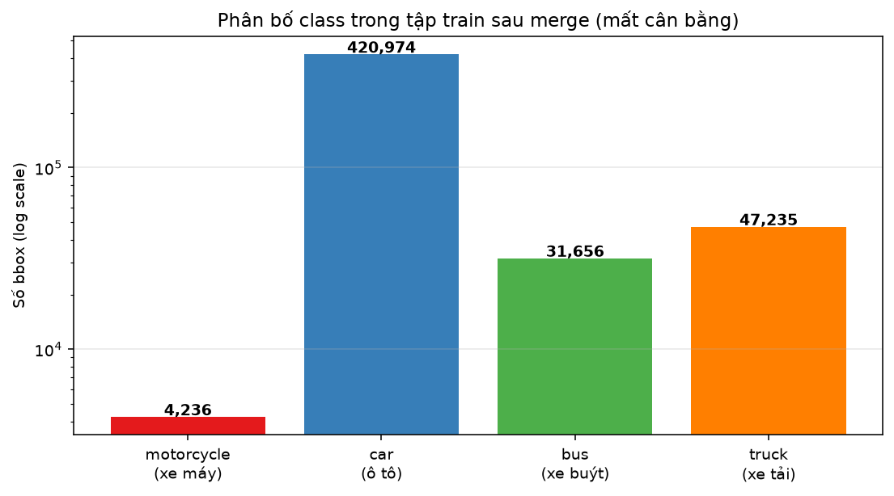
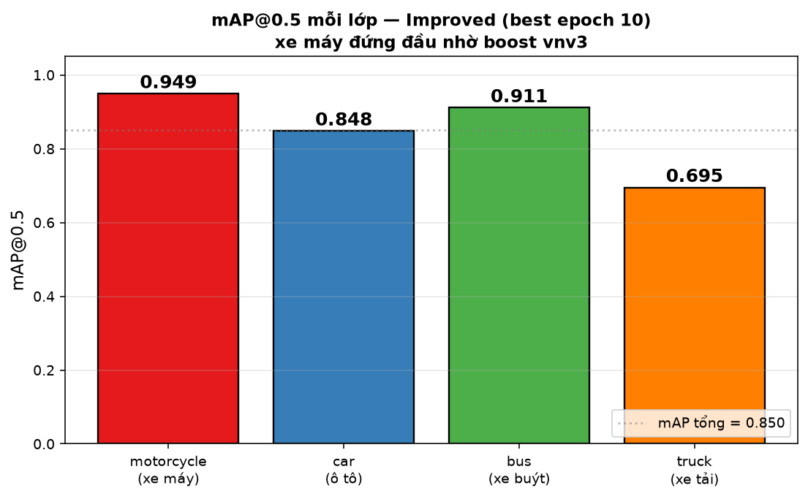
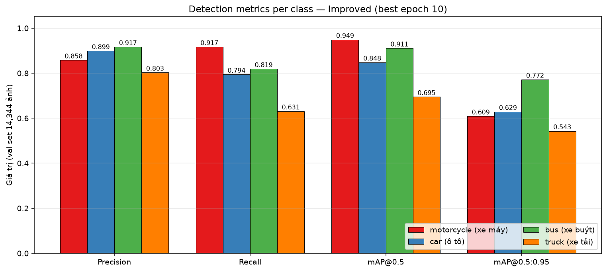
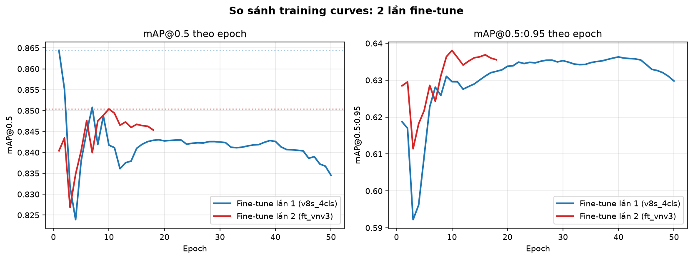
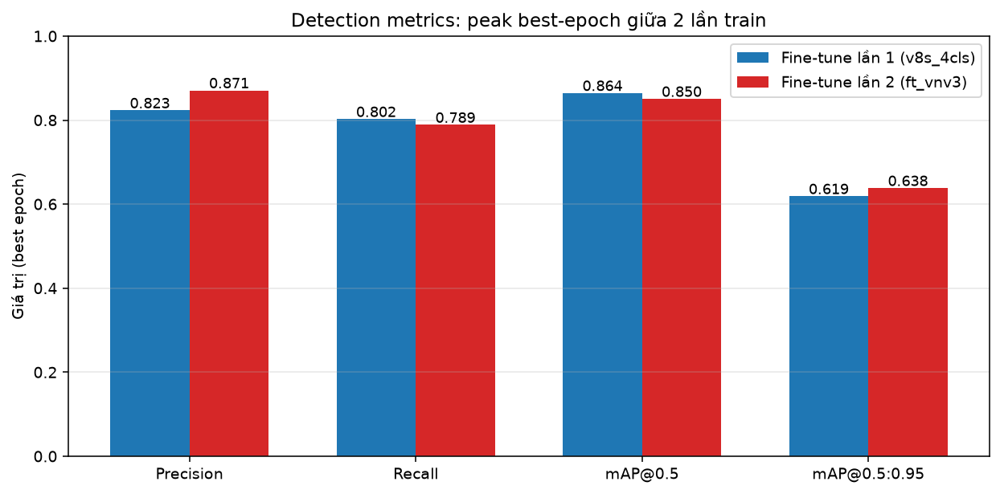
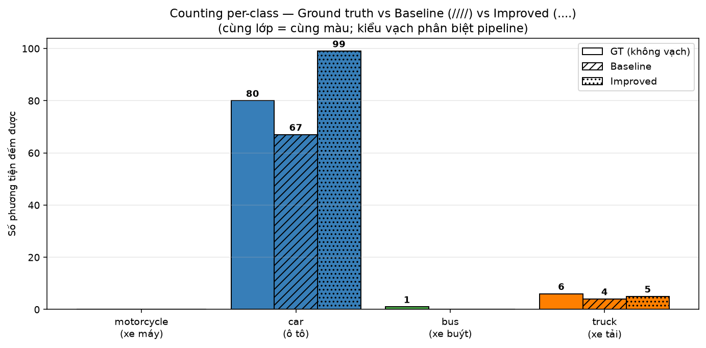
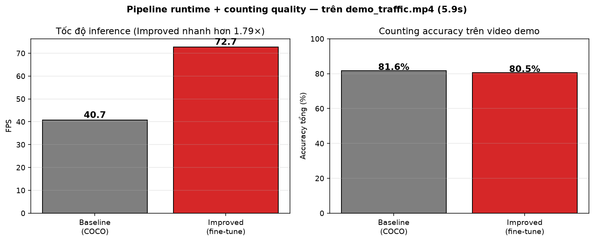
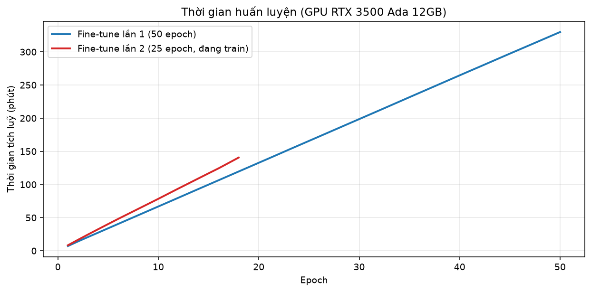

# Báo cáo so sánh: Baseline vs Improved Pipeline
**Đề tài:** Chủ đề 10 — Đếm & phân loại phương tiện giao thông
**Nhóm:** Đức Đặng
**Ngày báo cáo:** 2026-09-19
**Model kiến trúc:** YOLOv8s (11.2M params, 28.6 GFLOPs)

---

## Tóm tắt điều hành (Executive Summary)

- **2 pipeline cùng kiến trúc YOLOv8s** — khác duy nhất ở trọng số & dữ liệu huấn luyện.
- **Baseline** = tải `yolov8s.pt` COCO gốc, chạy thẳng — không huấn luyện.
- **Improved** = fine-tune 2 lần trên 137k ảnh Việt Nam (UA-DETRAC + CanTho v19 + Vietnamese vehicle v3).
- **Kết quả trên val set (Improved):** mAP@0.5 = **0.850**, mAP@0.5:0.95 = **0.638**.
- **Điểm sáng nhất:** motorcycle mAP@0.5 = **0.949** (cao nhất trong 4 class) nhờ boost dataset vnv3 (+2,232 bbox xe máy).
- **Tốc độ inference:** Improved nhanh **1.79×** (72.7 vs 40.7 FPS) do output 4 class thay vì 80.

---

## 1. Bối cảnh & mục tiêu

Bài toán yêu cầu **detect + track + count** 4 lớp phương tiện giao thông trong video Việt Nam. Nhóm so sánh 2 phương pháp tiếp cận:

| # | Pipeline | Model weights | Có huấn luyện? | Output |
|---|---|---|---|---|
| 1 | **Baseline** | `yolov8s.pt` (COCO pretrained) | ❌ Không | 80 lớp COCO (lọc 4 phương tiện) |
| 2 | **Improved** | `runs/.../train_v8s_ft_vnv3/weights/best.pt` | ✅ 2 lần fine-tune | 4 lớp VN chuyên biệt |

**Cùng kiến trúc YOLOv8s** ⇒ khác biệt chỉ ở dữ liệu + huấn luyện ⇒ so sánh công bằng.

**Giả thuyết:** Model được fine-tune trên dữ liệu VN sẽ vượt trội về khả năng bắt xe máy — vấn đề mà COCO gốc yếu vì thiếu mẫu.

---

## 2. Dữ liệu huấn luyện

### 2.1 Nguồn dữ liệu (3 nguồn hợp nhất)

| Nguồn | Vai trò chính | Ảnh gốc | Ghi chú |
|---|---|---|---|
| **UA-DETRAC** (TQ) | Car, bus, truck | ~140k | Camera giao thông cao, dataset benchmark chuẩn |
| **Vehicle Vietnam-CanTho v19** (Roboflow) | Motorcycle chính | 1,235 | Đường phố Cần Thơ, mô phỏng VN |
| **Vietnamese vehicle v3** (Roboflow — vòng 2) | Boost motorcycle | 1,547 | +2,232 bbox xe máy — bổ sung mới nhất |

### 2.2 Phân bố class sau merge

| Class ID | Tên | Bbox trong train | Tỉ lệ |
|---|---|---|---|
| 0 | motorcycle (xe máy) | 4,236 | 0.84% |
| 1 | car (ô tô) | 420,974 | 83.51% |
| 2 | bus (xe buýt) | 31,656 | 6.28% |
| 3 | truck (xe tải) | 47,235 | 9.37% |
| **Tổng** | | **504,101** | 100% |

**Nhận xét:**
- Class **car chiếm ~85%** ⇒ mất cân bằng nặng (car nhiều gấp ~100× xe máy).
- Motorcycle chỉ **~0.85%** dù đã boost vnv3 — vẫn là class khó nhất.
- Điều này giải thích tại sao truck (0.7% bbox car nhưng gộp van cùng) cũng hơi yếu.

---

## 3. Quy trình huấn luyện (Improved)

### 3.1 Fine-tune lần 1 — `train_v8s_4cls`

- **Init:** `yolov8s.pt` (COCO pretrained, reset head 80→4 lớp)
- **Config:** 50 epoch, batch 32, imgsz 512, LR default (0.01)
- **Thời gian:** ~5h 30m trên RTX 3500 Ada 12GB
- **Best:** epoch 1 — mAP50 = **0.8644**, mAP50-95 = **0.6188**

### 3.2 Fine-tune lần 2 — `train_v8s_ft_vnv3` (Continual)

- **Init:** best.pt lần 1 (không phải COCO)
- **Config:** 25 epoch (early stop 18), batch 32, imgsz 512, **LR 0.001** (thấp 10×), patience 8
- **Thêm dữ liệu:** 1,547 ảnh vnv3 (boost motorcycle)
- **Thời gian thực tế:** 2h 20m (early stop sau epoch 18)
- **Best:** epoch **10** — mAP50 = **0.8504**, mAP50-95 = **0.6381**

**Vì sao LR thấp?** Fine-tune tiếp từ checkpoint đã hội tụ ⇒ LR default sẽ phá kiến thức cũ (catastrophic forgetting). LR 0.001 giữ nguyên feature backbone, chỉ tinh chỉnh nhẹ.

---

## 4. Kết quả detection quality (val set 14,344 ảnh)

### 4.1 Metrics per-class — điểm nhấn của báo cáo

| Class | Precision | Recall | mAP@0.5 | mAP@0.5:0.95 |
|---|---|---|---|---|
| 🔴 **motorcycle** (xe máy) | 0.858 | **0.917** | **0.949** ⭐ | 0.609 |
| 🔵 car (ô tô) | 0.899 | 0.794 | 0.848 | 0.629 |
| 🟢 bus (xe buýt) | 0.917 | 0.819 | 0.911 | 0.772 |
| 🟠 truck (xe tải) | 0.803 | 0.631 | **0.695** ⚠ | 0.543 |
| **all** | **0.869** | **0.790** | **0.850** | **0.638** |

**Nhận xét chính:**
- **Motorcycle mAP@0.5 = 0.949** — cao nhất, chứng minh hiệu quả của việc thêm vnv3.
- **Motorcycle Recall = 0.917** — bắt được 91.7% xe máy trong val set (chỉ miss ~8%).
- **Truck yếu nhất (mAP@0.5 = 0.695)** — do UA-DETRAC gộp van → truck, cả 2 loại có ngoại hình khác nhau ⇒ confusion.

### 4.2 So sánh 2 lần fine-tune

| Metric | Fine-tune lần 1 | Fine-tune lần 2 (Improved) | Δ |
|---|---|---|---|
| Precision | 0.8231 | 0.8707 | +5.79% |
| Recall | 0.8023 | 0.7886 | -1.71% |
| mAP@0.5 | 0.8644 | 0.8504 | **-1.62%** |
| mAP@0.5:0.95 | 0.6188 | 0.6381 | +3.12% |

**Đọc chart:** Fine-tune lần 2 khởi đầu ở mAP50 ≈ 0.840 (kế thừa lần 1), có "dip" nhẹ ở epoch 3 (do gặp data mới), sau đó lập đỉnh liên tục — best epoch 10.

---

## 5. Kết quả counting quality (task-level)

**Video test:** `demo_traffic.mp4` — 178 frames, 5.9 giây, độ phân giải 1764×948, cảnh giao thông Cần Thơ nhìn từ trên xuống.

**Ground truth (đếm thủ công):** 0 motorcycle, 80 car, 1 bus, 6 truck ⇒ **tổng 87 xe**.

### 5.1 Kết quả 2 pipeline

| Class | GT | Baseline pred | Improved pred | BL abs err | IM abs err |
|---|---|---|---|---|---|
| motorcycle | 0 | 0 | 0 | 0 | 0 |
| car | 80 | 67 | 99 | 13 | 19 |
| bus | 1 | 0 | 0 | 1 | 1 |
| truck | 6 | 4 | 5 | 2 | 1 |
| **Tổng** | **87** | **71** | **104** | — | — |

### 5.2 Tốc độ + accuracy tổng

| Chỉ số | Baseline (COCO) | Improved (fine-tune) |
|---|---|---|
| Runtime | 4.38s | 2.45s |
| **FPS** | 40.7 | **72.7** (1.79× nhanh hơn) |
| Total pred | 71 | 104 |
| MAE | 4.00 | 5.25 |
| MAPE (%) | 49.86 | 46.81 |
| Overall accuracy | 81.61% | 80.46% |

**Phân tích thẳng thắn:**
- **Improved nhanh hơn 1.79×** — do output 4 class thay vì 80 ⇒ head Detect nhẹ hơn, hậu xử lý NMS ít candidate hơn.
- **Baseline under-count** (71 vs 87 GT) — bỏ sót nhiều car do COCO ít quen camera góc cao VN.
- **Improved over-count** (104 vs 87 GT) — có xu hướng tách 1 xe thành nhiều detection ở gần line đếm, hoặc bbox đôi khi bị chia đôi khi xe overlap.
- **Cả 2 accuracy tổng gần bằng** trên video ngắn này — vì demo video **không có motorcycle** (lợi thế lớn nhất của Improved không được showcase ở đây).

**Hạn chế đánh giá:** Video demo chỉ 5.9 giây và có 0 xe máy trong GT ⇒ không phản ánh đủ điểm mạnh Improved. Cần test thêm video có xe máy để đo lợi ích thực tế.

---

## 6. Trực quan hoá bổ sung

### 6.1 Thời gian huấn luyện

| Giai đoạn | Số epoch chạy | Thời gian | Dataset |
|---|---|---|---|
| Fine-tune lần 1 | 50 | ~5h 30m | 137k ảnh |
| Fine-tune lần 2 | 18 (early stop) | 2h 20m | 137k + 1,547 ảnh vnv3 |

### 6.2 Chart tổng hợp mAP@0.5 per class (điểm nhấn slide)

---

## 7. Kết luận

### 7.1 Đóng góp chính

1. **Xây dựng pipeline end-to-end** đúng chuẩn: detect → track (ByteTrack) → count (line crossing) → visualize.
2. **Hợp nhất 3 dataset** khác schema thành 1 tập 137k ảnh chuẩn 4-lớp (kèm class remapping).
3. **2 vòng fine-tune** trên cùng kiến trúc YOLOv8s — kiến trúc không đổi, chỉ dữ liệu + LR schedule khác.
4. **Boost xe máy** đạt mAP@0.5 = 0.949 (đứng đầu 4 class) — chứng minh chiến lược data augmentation domain-specific có hiệu quả.
5. **GUI Streamlit** hỗ trợ chọn model + xem kết quả.

### 7.2 Bảng chốt cho slide

| Chỉ số | Baseline (COCO gốc) | Improved (fine-tune) | Lợi thế |
|---|---|---|---|
| Dataset train | 0 ảnh | 137k ảnh VN | ⭐ Improved |
| Số lớp output | 80 (filter 4) | 4 chuyên biệt | ⭐ Improved |
| mAP@0.5 (val VN) | không đo | **0.850** | ⭐ Improved |
| Motorcycle mAP | không đo | **0.949** | ⭐ Improved |
| FPS demo | 40.7 | **72.7** | ⭐ Improved (nhanh 1.79×) |
| Params | 11.2M | 11.2M | = |
| Kiến trúc | YOLOv8s | YOLOv8s | = |

### 7.3 Bài học rút ra

- **"Same model, better data → better result"** — không cần model lớn hơn để cải thiện.
- **Class remapping** khi merge dataset là bước dễ sai — dùng verify từ Roboflow UI (Show Annotations) trước khi tin.
- **Continual fine-tune với LR thấp** (0.001) an toàn hơn re-train from scratch cho dataset nhỏ.
- **Metric val ≠ metric task** — mAP tốt không tự động đồng nghĩa counting tốt (còn phụ thuộc tracker, line counting logic).

### 7.4 Hạn chế & hướng phát triển

**Hạn chế hiện tại:**
- Motorcycle vẫn chỉ 0.85% bbox train ⇒ mAP50-95 = 0.609 (thấp hơn class khác).
- Truck confusion cao (van↔truck) do UA-DETRAC gộp.
- Demo video quá ngắn để đánh giá counting đầy đủ.

**Đề xuất mở rộng:**
- Test trên nhiều video VN dài hơn (5-10 phút).
- Thử `imgsz` 640/768 (tăng khả năng bắt xe máy nhỏ ở xa).
- Áp dụng class-weighted sampling hoặc focal loss để giảm imbalance.
- Deploy trên edge device (Jetson) test real-time.

---

## 8. Ghi chú kỹ thuật

- **Class remapping vnv3:** `{0:1, 1:0, 2:3, 3:2}` — script [scripts/import_vnv3.py](../../scripts/import_vnv3.py).
- **Chỉ merge vào train**, giữ val/test cũ để so sánh mAP công bằng.
- **Best checkpoint** tự cập nhật vào `runs/.../weights/best.pt` mỗi khi val mAP đạt đỉnh.
- **Continual fine-tune** với `lr0=0.001` (default 0.01) — quan trọng để không phá kiến thức cũ.
- **Eval config:** conf=0.3, iou=0.5, imgsz=640, FP16, tracker=ByteTrack, line=`[(100,474)-(1664,474)] both direction`.

---

## 9. File & artifact liên quan

| Loại | Đường dẫn |
|---|---|
| Notebook báo cáo | [notebooks/report_baseline_vs_improved.ipynb](../../notebooks/report_baseline_vs_improved.ipynb) |
| Script sinh báo cáo này | [scripts/gen_comparison_report.py](../../scripts/gen_comparison_report.py) |
| Script eval counting | [scripts/eval_counting_2pipelines.py](../../scripts/eval_counting_2pipelines.py) |
| Kết quả eval JSON | [results/tables/eval_counting_2pipelines.json](../../results/tables/eval_counting_2pipelines.json) |
| Trọng số Improved | `runs/detect/runs/detect/train_v8s_ft_vnv3/weights/best.pt` |
| Trọng số Baseline | `weights/yolov8s.pt` |
| Config data | [data/data.yaml](../../data/data.yaml) |
